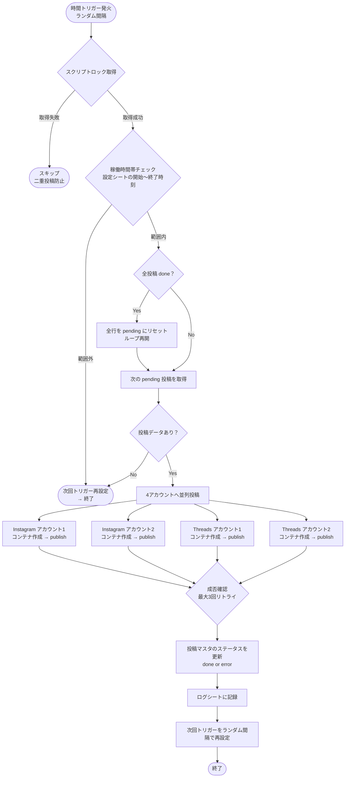

# システムアーキテクチャ

## 概要

Google Apps Script (GAS) を中心に構築する、Instagram・Threads 4アカウント同時自動投稿システム。  
外部有料サービス（Buffer / Make等）を使わず、**GAS の無料枠のみ**で動作するため月額ランニングコスト0円を実現する。

---

## 処理フロー



---

## ランニングコストが無料になる根拠

| 比較項目 | Buffer/Make | 本システム（GAS） |
|----------|-------------|------------------|
| 月額費用 | 月1,500〜5,000円程度 | **0円** |
| 投稿数上限 | プランによる制限あり | GAS 無料枠内で十分 |
| インフラ管理 | 不要（SaaS） | 不要（Google管理） |
| 設定変更 | サービス上で操作 | スプレッドシートを編集 |
| API制限 | サービス経由 | 直接 Meta API へ |

### GAS 無料枠と本システムの消費量

| GAS リソース | 無料枠 | 本システムの消費（推定） |
|-------------|--------|------------------------|
| 実行時間/日 | 6時間 | 約4分/日（1投稿30分×4アカウント×2秒/投稿） |
| UrlFetch 呼び出し/日 | 20,000回 | 約64回/日（1投稿×4アカウント×(コンテナ作成+ステータス確認×2+publish)=8呼び出し×8投稿/日） |
| トリガー起動 | 制限なし（6時間枠内） | 約16回/日（30分間隔・稼働15時間） |

→ 無料枠の消費量は全体の **1%未満**。余裕を持って運用可能。

---

## トリガー設計

### 採用方式：自己再設定型トリガー（Self-Rescheduling Trigger）

```
[1回目のトリガー発火]
  → 投稿処理
  → 次回トリガーをランダム間隔で新規作成
  → 古いトリガーを削除
[2回目のトリガー発火（ランダム後）]
  → 繰り返し...
```

**この方式を採用した理由：**
- GAS の定期トリガー（毎N分）は最短1分間隔だが、**ランダム間隔には対応していない**。
- `.after(ミリ秒)` を使う自己再設定型なら、毎回異なる間隔を設定できる。
- 投稿タイミングが機械的に見えず、アルゴリズムによる検知リスクを低減できる。

### ランダム間隔の計算式

```
基準間隔（分）± ランダム幅（分）の範囲でランダム選択
例: 30 ± 10 → 20〜40分の間でランダム

// 実装
const intervalMs = baseMs + (Math.random() * randomRangeMs * 2 - randomRangeMs)
```

---

## API 制限への配慮

### Instagram Graph API

| 制限 | 値 | 対応策 |
|------|----|--------|
| 投稿レート制限 | 1アカウント 25投稿/日 | 1日あたりの投稿数は最大16回（30分間隔・15時間稼働）なので余裕あり |
| コンテナ作成〜publish の待機 | コンテナ状態が FINISHED になるまで待機が必要 | `_waitForContainerReady()` で最大30秒ポーリング |
| 画像アクセス | 公開URLからのみ取得可能 | Google Drive の共有リンク（直接ダウンロードURL形式）を使用 |

### Threads API

| 制限 | 値 | 対応策 |
|------|----|--------|
| 投稿レート制限 | 1アカウント 250投稿/日 | 稼働時間内の最大16投稿/日は余裕 |
| コンテナ処理待機 | Instagram と同様 | `_waitForContainerReady()` で対応 |

### 二重投稿防止

```
LockService.getScriptLock() を使用
→ 同一スクリプト実行が重複しないよう排他制御
→ 待機タイムアウト: 30秒（CONFIG.LOCK_WAIT_MS で変更可能）
```

---

## ファイル構成

```
.
├── Main.gs          # トリガーエントリポイント・トリガー管理
├── Config.gs        # 設定定数・Script Properties 参照
├── SheetRepo.gs     # スプレッドシート読み書き
├── InstagramApi.gs  # Instagram Graph API クライアント
├── ThreadsApi.gs    # Threads API クライアント
├── Poster.gs        # 投稿振り分け・リトライ・ログ記録
├── SHEET_SPEC.md    # スプレッドシート構造定義
├── ARCHITECTURE.md  # 本ファイル
└── README.md        # セットアップ・運用手順
```

---

## セキュリティ設計

- APIトークン・アクセストークンは **GAS の Script Properties に保存**し、ソースコードには一切記述しない。
- Script Properties は GAS プロジェクトオーナーのみ閲覧可能（スプレッドシート共有ユーザーからは見えない）。
- スプレッドシートには機密情報を含めない設計とする。
